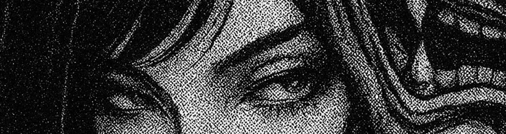

<!--
  GitHub Profile README — oxyd0x  (clean / underground · full-width banner)
  USE: repo named EXACTLY "oxyd0x" -> README.md.
  BANNER: put your image in the repo (e.g. assets/banner.webp) and keep the src below.
          self-hosted = never breaks. webp/png/jpg all render fine on GitHub.
-->



<div align="center">

`oxyd0x`

<sub>pentester · bug hunter — web / mobile / api</sub>


</div>

<br>

```c
> whoami

  manual-first researcher. i break access controls,
  forge server-side requests, and walk paths that
  weren't meant to be walked.

> focus    bola · idor · ssrf · path traversal · auth logic · secrets
> stack    burp pro · jadx · frida · mobsf · curl
> hunting  bugcrowd · intigriti · yeswehack
```

<!--
  ~/research — ACTIVATE ONLY WHEN PUBLIC + VERIFIABLE
  bludit advisory is private (triage) until the maintainer publishes it;
  the link 404s for others until then. add the real CVE id once assigned.

  > bludit cms — auth'd path traversal -> arbitrary file delete -> full takeover
    CVE-XXXX-XXXXX · GHSA-wf7c-w685-8mwm
-->

<div align="center">
<sub>// more soon</sub>
</div>
